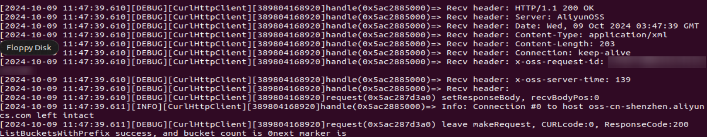

# aliyun-oss-cpp-sdk集成到应用hap

本库是在RK3568开发板上基于OpenHarmony3.2 Release版本的镜像验证的，如果是从未使用过RK3568，可以先查看[润和RK3568开发板标准系统快速上手](https://gitee.com/openharmony-sig/knowledge_demo_temp/tree/master/docs/rk3568_helloworld)。

## 开发环境

- [开发环境准备](../../../docs/hap_integrate_environment.md)

## 编译三方库

- 下载本仓库

  ```shell
  git clone https://gitee.com/openharmony-sig/tpc_c_cplusplus.git --depth=1
  ```

- 三方库目录结构

  ```shell
  tpc_c_cplusplus/thirdparty/aliyun-oss-cpp-sdk  	#三方库aliyun-oss-cpp-sdk-1.10.0的目录结构如下
  ├── docs                            		  			#三方库相关文档的文件夹
  ├── HPKBUILD                        		  			#构建脚本
  ├── HPKCHECK                         		 			#测试脚本
  ├── SHA512SUM                        					#三方库校验文件
  ├── README.OpenSource                 					#说明三方库源码的下载地址，版本，license等信息
  ├── README_zh.md                      					#三方库简介
  ├── aliyun-oss-cpp-sdk_1.10.0_oh_pkg.patch				#三方库适配patch
  ```

- 在lycium目录下编译三方库

  编译环境的搭建参考[准备三方库构建环境](../../../lycium/README.md#1编译环境准备)

  ```shell
  cd lycium
  ./build.sh aliyun-oss-cpp-sdk
  ```

- 三方库头文件及生成的库

  在lycium目录下会生成usr目录，该目录下存在已编译完成的32位和64位三方库

  ```shell
  aliyun-oss-cpp-sdk/arm64-v8a   aliyun-oss-cpp-sdk/armeabi-v7a
  ```

- [测试三方库](#测试三方库)

- 编译出可执行的文件进行测试，[准备三方库测试环境](../../../lycium/README.md#3ci环境准备)
## 应用中使用三方库

- 在IDE的cpp目录下新增thirdparty目录，将编译生成的头文件拷贝到该目录下，将编译生成的三方库以及依赖库全部（动态库名字带版本号和不带版本号的都需要）拷贝到工程的libs目录下，如下图所示：
  &nbsp;

  &nbsp;

  
  
- 在最外层（cpp目录下）CMakeLists.txt中添加如下语句

  ```shell
  #将三方库加入工程中
  target_link_libraries(entry PRIVATE
      ${CMAKE_CURRENT_SOURCE_DIR}/thirdparty/aliyun-oss-cpp-sdk/${OHOS_ARCH}/lib/libalibabacloud-oss-cpp-sdk.so
      ${CMAKE_CURRENT_SOURCE_DIR}/thirdparty/curl/${OHOS_ARCH}/lib/libcurl.so.4
      ${CMAKE_CURRENT_SOURCE_DIR}/thirdparty/nghttp2/${OHOS_ARCH}/lib/libnghttp2.so.14
      ${CMAKE_CURRENT_SOURCE_DIR}/thirdparty/zstd_1_5_6/${OHOS_ARCH}/lib/libzstd.so.1
      ${CMAKE_CURRENT_SOURCE_DIR}/thirdparty/zlib_1_3_1/${OHOS_ARCH}/lib/libz.so.1)
  
  #将三方库的头文件加入工程中
  target_include_directories(entry PRIVATE
      ${CMAKE_CURRENT_SOURCE_DIR}/thirdparty/aliyun-oss-cpp-sdk/${OHOS_ARCH}/include
      ${CMAKE_CURRENT_SOURCE_DIR}/thirdparty/curl/${OHOS_ARCH}/include
      ${CMAKE_CURRENT_SOURCE_DIR}/thirdparty/nghttp2/${OHOS_ARCH}/include
      ${CMAKE_CURRENT_SOURCE_DIR}/thirdparty/openssl/${OHOS_ARCH}/include
      ${CMAKE_CURRENT_SOURCE_DIR}/thirdparty/zstd_1_5_6/${OHOS_ARCH}/include
      ${CMAKE_CURRENT_SOURCE_DIR}/thirdparty/zlib_1_3_1/${OHOS_ARCH}/include)
  ```

## 测试三方库
将tpc_c_cplusplus整体拷贝到设备里面后，进入设备里面对应文件目录下运行测试用例（注意arm64-v8a为构建64位的目录，armeabi-v7a为构建32位的目录），执行结果如图所示

**特别注意:因测试用例需要用到aliyun账号以及bucket，如需要进行测试请自行将tpc_c_cplusplus/thirdparty/aliyun-oss-cpp-sdk/aliyun-oss-cpp-sdk-1.10.0/arm64-v8a-build/sample/src中的Config.cc文件中所列出的信息补充完整**

```shell
  cd /data/tpc_c_cplusplus/thirdparty/aliyun-oss-cpp-sdk/aliyun-oss-cpp-sdk-1.10.0/arm64-v8a-build/sample
  ./cpp-sdk-sample
```
&nbsp;

## 参考资料

- [润和RK3568开发板标准系统快速上手](https://gitee.com/openharmony-sig/knowledge_demo_temp/tree/master/docs/rk3568_helloworld)
- [OpenHarmony三方库地址](https://gitee.com/openharmony-tpc)
- [OpenHarmony知识体系](https://gitee.com/openharmony-sig/knowledge)