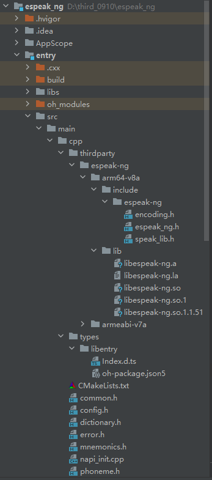
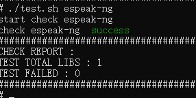

# espeak-ng集成到应用hap
本库是在RK3568开发板上基于OpenHarmony3.2 Release版本的镜像验证的，如果是从未使用过RK3568，可以先查看[润和RK3568开发板标准系统快速上手](https://gitee.com/openharmony-sig/knowledge_demo_temp/tree/master/docs/rk3568_helloworld)。
## 开发环境

- [开发环境准备](../../../docs/hap_integrate_environment.md)

## 编译三方库
- 下载本仓库
  ```
  git clone https://gitee.com/openharmony-sig/tpc_c_cplusplus.git --depth=1
  ```
  
- 三方库目录结构
  ```
    tpc_c_cplusplus/thirdparty/espeak-ng		#三方库espeak-ng的目录结构如下
    ├── espeak-ng                             #三方库espeak-ng的目录
    │   ├── HPKBUILD						    #构建脚笨
    │   ├── HPKCHECK						    #测试脚本
    │   ├── README.OpenSource				    #说明三方库源码的下载地址，版本，license等信息
    │   ├── README_zh.md					    #espeak-ng三方库说明
    │   └── docs                              #三方库相关文档的文件夹
    │       ├── pic
    │       │   ├── espeak-ng_install.png
    │       │   └── espeak-ng_test.png
    │       └── hap_integrate.md
  ```
  
- 编译三方库
  编译环境的搭建参考[准备三方库构建环境](../../../lycium/README.md#1编译环境准备)
  
  ```
  cd lycium
  ./build.sh espeak-ng
  ```
  
- 三方库头文件及生成的库
  在lycium目录下会生成usr目录，该目录下存在已编译完成的32位和64位三方库
  
  ```
  espeak-ng/arm64-v8a   espeak-ng/armeabi-v7a
  ```
  
- [测试三方库](#测试三方库)

## 应用中使用三方库

- 在IDE的cpp目录下新增thirdparty目录，将编译生成的三方库的静态库文件（所有的.a文件）拷贝到工程的libs目录下，如下图所示

  &nbsp;

- 在最外层（cpp目录下）CMakeLists.txt中添加如下语句
  ```
  
  include_directories(${CMAKE_CURRENT_SOURCE_DIR}/thirdparty/espeak-ng/${OHOS_ARCH}/include)
  target_link_libraries(entry PRIVATE ${CMAKE_CURRENT_SOURCE_DIR}/thirdparty/espeak-ng/${OHOS_ARCH}/lib/libespeak-ng.a)  
  ```
## 测试三方库
三方库的测试使用原库自带的测试用例来做测试，[准备三方库测试环境](../../../lycium/README.md#3ci环境准备)

在lycium目录下，执行脚本
```shell
cd lycium
./test.sh espeak-ng
```



## 参考资料
- [润和RK3568开发板标准系统快速上手](https://gitee.com/openharmony-sig/knowledge_demo_temp/tree/master/docs/rk3568_helloworld)
- [OpenHarmony三方库地址](https://gitee.com/openharmony-tpc)
- [OpenHarmony知识体系](https://gitee.com/openharmony-sig/knowledge)
- [通过DevEco Studio开发一个NAPI工程](https://gitee.com/openharmony-sig/knowledge_demo_temp/blob/master/docs/napi_study/docs/hello_napi.md)
