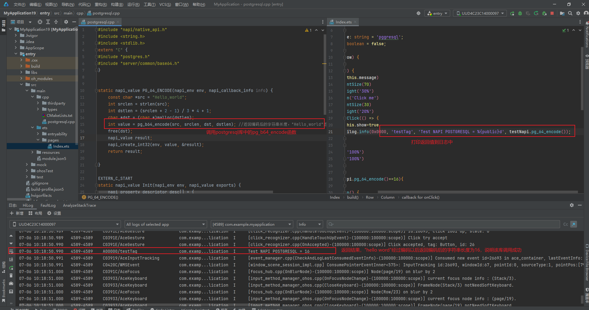

# postgresql集成到应用hap

本库是在RK3568开发板上基于OpenHarmony3.2 Release版本的镜像验证的，如果是从未使用过RK3568，可以先查看[润和RK3568开发板标准系统快速上手](https://gitee.com/openharmony-sig/knowledge_demo_temp/tree/master/docs/rk3568_helloworld)。

## 开发环境

- [开发环境准备](../../../docs/hap_integrate_environment.md)

## 编译三方库

- 下载本仓库

  ```shell
  git clone https://gitee.com/openharmony-sig/tpc_c_cplusplus.git --depth=1
  ```

- 三方库目录结构

  ```shell
  tpc_c_cplusplus/thirdparty/postgresql      #三方库postgresql的目录结构如下
  ├── docs                                   #三方库相关文档的文件              
  ├── HPKBUILD                               #构建脚本
  ├── HPKCHECK                               #测试脚本
  ├── SHA512SUM                              #三方库校验文件
  ├── README.OpenSource                      #说明三方库源码的下载地址，版本、license等信息
  ├── README_zh.md   
  ├── postgresql_ohos_pkg.patch              #pkg补丁

  ```
  
- 在lycium目录下编译三方库

  编译环境的搭建参考[准备三方库构建环境](../../../lycium/README.md#1编译环境准备)

  ```shell
  cd lycium
  ./build.sh postgresql
  ```

- 三方库头文件及生成的库

  在lycium目录下会生成usr目录，该目录下存在已编译完成的32位和64位三方库

  ```shell
  postgresql/arm64-v8a   postgresql/armeabi-v7a
  ```
  
- [测试三方库](#测试三方库)

## 应用中使用三方库

- 在IDE的cpp目录下新增thirdparty目录，将编译生成的库和头文件拷贝到该目录下，如下图所示

- 

- 在最外层（cpp目录下）CMakeLists.txt中添加如下语句

  ```cmake
  target_include_directories(entry PRIVATE ${CMAKE_CURRENT_SOURCE_DIR}/thirdparty/postgresql/${OHOS_ARCH}/include)
  target_include_directories(entry PRIVATE ${CMAKE_CURRENT_SOURCE_DIR}/thirdparty/postgresql/${OHOS_ARCH}/include/server)
  target_include_directories(entry PRIVATE ${CMAKE_CURRENT_SOURCE_DIR}/thirdparty/postgresql/${OHOS_ARCH}/include/libpq)
  target_include_directories(entry PRIVATE ${CMAKE_CURRENT_SOURCE_DIR}/thirdparty/postgresql/${OHOS_ARCH}/include/internal)
  target_include_directories(entry PRIVATE ${CMAKE_CURRENT_SOURCE_DIR}/thirdparty/postgresql/${OHOS_ARCH}/include/informix)
  target_include_directories(entry PRIVATE ${CMAKE_CURRENT_SOURCE_DIR}/thirdparty/postgresql/${OHOS_ARCH}/include/informix/esql)
  target_include_directories(entry PRIVATE ${CMAKE_CURRENT_SOURCE_DIR}/thirdparty/postgresql/${OHOS_ARCH}/include/internal/libpq)
  target_include_directories(entry PRIVATE ${CMAKE_CURRENT_SOURCE_DIR}/thirdparty/postgresql/${OHOS_ARCH}/include/server/access)
  target_include_directories(entry PRIVATE ${CMAKE_CURRENT_SOURCE_DIR}/thirdparty/postgresql/${OHOS_ARCH}/include/server/access/archive)

  target_link_libraries(entry PRIVATE ${CMAKE_CURRENT_SOURCE_DIR}/thirdparty/postgresql/${OHOS_ARCH}/lib/libpgcommon.a)
  target_link_libraries(entry PRIVATE ${CMAKE_CURRENT_SOURCE_DIR}/thirdparty/postgresql/${OHOS_ARCH}/lib/libpgcommon_shlib.a)
  target_link_libraries(entry PRIVATE ${CMAKE_CURRENT_SOURCE_DIR}/thirdparty/postgresql/${OHOS_ARCH}/lib/libpgfeutils.a)
  target_link_libraries(entry PRIVATE ${CMAKE_CURRENT_SOURCE_DIR}/thirdparty/postgresql/${OHOS_ARCH}/lib/libpgport.a)
  target_link_libraries(entry PRIVATE ${CMAKE_CURRENT_SOURCE_DIR}/thirdparty/postgresql/${OHOS_ARCH}/lib/libpgport_shlib.a)
  target_link_libraries(entry PRIVATE ${CMAKE_CURRENT_SOURCE_DIR}/thirdparty/postgresql/${OHOS_ARCH}/lib/libecpg_compat.a)
  target_link_libraries(entry PRIVATE ${CMAKE_CURRENT_SOURCE_DIR}/thirdparty/postgresql/${OHOS_ARCH}/lib/libecpg.a)
  target_link_libraries(entry PRIVATE ${CMAKE_CURRENT_SOURCE_DIR}/thirdparty/postgresql/${OHOS_ARCH}/lib/libpgtypes.a)
  target_link_libraries(entry PRIVATE ${CMAKE_CURRENT_SOURCE_DIR}/thirdparty/postgresql/${OHOS_ARCH}/lib/libpq.a)


  ```

## 编写NAPI接口
  
- napi接口注册
```
  static napi_value Init(napi_env env, napi_value exports) {
    napi_property_descriptor desc[] = {
        {"pg_64_encode", nullptr, PG_64_ENCODE, nullptr, nullptr, nullptr, napi_default, nullptr}};
    napi_define_properties(env, exports, sizeof(desc) / sizeof(desc[0]), desc);
    return exports;
}
```
- napi接口实现
  - pg_b64_encode接口的实现
```
    static napi_value PG_64_ENCODE(napi_env env, napi_callback_info info) {
      const char *src = "Hello,world";
      int srclen = strlen(src);
      int dstlen = (srclen + 2 - 1) / 3 * 4 + 1;
      char *dst = (char *)malloc(dstlen);
      int value = pg_b64_encode(src, srclen, dst, dstlen); //返回编码后的字符串长度，"Hello,world"返回长度为16，错误返回-1;
      free(dst);
      napi_value result;
      napi_create_int32(env, value, &result);
      return result;
    
}
```
## 应用调用napi接口
- 接口声明在确定需要封装的接口后，我们需要将这些接口定义在index.d.ts文件中(路径entry/src/main/cpp/types/libentry/index.d.ts)
```
    export const pg_64_encode: () => number;
```
- JS应用调用接口

```

          Column() {
            Text(this.message)
              .fontSize(70)
              .height('30%')
            Button('Click me')
              .fontSize(30)
              .height('20%')
              .onClick(() => {
                this.show=true
                hilog.info(0x0000, 'testTag', 'Test NAPI POSTGRESQL = %{public}d', testNapi.pg_64_encode());
              })
          }
          .width('100%')
    

```

- HAP验证结果
 

## 测试三方库

三方库的测试使用原库自带的测试用例来做测试，[准备三方库测试环境](../../../lycium/README.md#3ci环境准备)

进入到对应版本目录,根据你的实际路径，参考执行如下命令
```
hdc target mount
export PATH=/data/CIusr/bin:$PATH
chmod -R 777 postgresql-16.3-arm64-v8a-build

export LD_LIBRARY_PATH=/data/tpc_c_cplusplus/lycium/usr/icu/arm64-v8a/lib:$ LD_LIBRARY_PATH 
mkdir -p /data/bin/

ln -s /data/tpc_c_cplusplus/thirdparty/tzdb/tzdb-2024a-arm64-v8a-build/zic /data/bin/

cd /home/cwx1312875/tpc_c_cplusplus/thirdparty/postgresql/postgresql-16.3-arm64-v8a-build
su system
make check
```


## FAQ
在进行make check测试时，对测试的目标设备需要进行联网对时间同步，否则可能会有个别测试用例失败的情况。
并且确保CI工具的su命令和make命令可用

## 参考资料

- [OpenHarmony三方库地址](https://gitee.com/openharmony-tpc)
- [OpenHarmony知识体系](https://gitee.com/openharmony-sig/knowledge)
- [通过DevEco Studio开发一个NAPI工程](https://gitee.com/openharmony-sig/knowledge_demo_temp/blob/master/docs/napi_study/docs/hello_napi.md)
